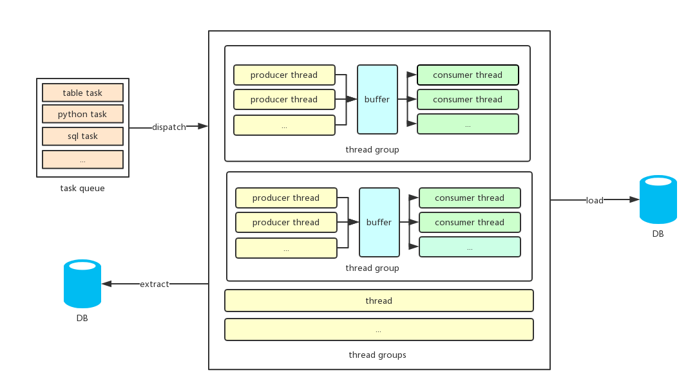

# Carry   [](https://travis-ci.org/toaco/carry)  [](https://coveralls.io/github/toaco/carry?branch=master)

[中文文档](./docs/README_zh_CN.md)

Carry is a data migration tool based on SQLAlchemy and Pandas.

## Features

- Easy to use
- ETL
    - Supports data migration between common relational databases and CSV files, including Firebird, Microsoft SQL Server, MySQL, Oracle, PostgreSQL, SQLite, Sybase
    - Support for migrating data queried using SQL statements and automatically creating views based on the SQL statements for later reference
    - Support the complex conversion of the extracted data, such as: add/delete/change fields, add/delete/change lines, split lines, mergers, etc.
- Performance
    - Implemented the Producer-consumer pattern to speed up the migration of a table
    - Multi-table parallel migration

## Design



## Installation

```python
pip install carry
```

## Configuration

The following describes how to write a configuration file of an example: Migrating data from an Oracle database to the `table_a` table in MySQL.

```python
# STORES is used to configure databases
STORES = [
    {
        'name': 'oracle_db',
        'url': 'oracle: // username: password @ host: port / dbname',
    },
    {
        'name': 'mysql_db',
        'url': 'mysql: // username: password @ host: port / dbname',
    }
]
# TASK is used to configure the ETL process
TASKS = [
    {
        'from': [{
            'name': 'oracle_db'
        }],
        'to': {
            'name': 'mysql_db',
        },
        'orders': [
            'table_a',
        ]
    }
]
```

## How to startup

There are two ways to startup our migration, the first is to save the configuration into a `.py` file, and then execute the `carry filename.py` command in the file's directory. If the file name is` carfile.py`, you can omit the file name part.

The second way is to call carry's run method, you need to pass the configuration file path to the method.

```python
if __name__ == '__main__':
    import carry
    carry.run (__ file__)
```

## STORES Configuration

`STORES` is used to configure the databases, a database can be a relational database or a CSV folder. The value of `STORES` is a list, each item of which is a dict and represents a database's configuration. The dict need a `name` key to set the identifier of the database.

For relational databases, you need to set the `url` key, which is the SQLAlchemy connection string for that database. The example above is configured with a database called `oracle_db` and a database called `mysql_db`.

## TASKS Configuration

`TASKS` is used to configure the migration process. Its value is a list, each item in the list represents an ETL process. Each ETL process is configured through a dictionary that contains ` from`, `to` and `orders` keys.

- `from` is used to configure the data source. Its value is a dictionary list. Each dictionary needs to set the value of name (using the database name configured in` STORES`) to indicate a data source.
- `to` is similar to `from`, representing the target database. The difference is that the value is a dictionary, not a list.
- `orders` configure subtasks. A sub-task can be a `table task`, a `SQL task` or a `python task`. 

The `TASKS` configuration in the example above means that data is fetched from the database named `oracle_db` to the `table_a` table in the database named `mysql_db`.

## Sub-task Configuration

Carry currently has three types of subtasks: `Table Migration Task`, `SQL Script Task` and `Python Task`.

The table migration task represents migrating data of a table from the data source to the target database. SQL script task means executing some SQL scripts in the target database. The Python task is to call a Python object, such as a function.

### Table Migration Task

A table migration task represents extracting data from data sources, transform it(optionally) and finally load it into a table in the target database. You can configure a table migration task directly using the table name. 

Carry will decide how to migrate data in the following steps, taking the previous configuration as an example:

1. First, carry need to decide what to be extracted
   1. If data source `A` is a relational database and the `table_a.sql` file is found in the `./oracle_db`folder, Carry will execute `table_a.sql` in `A` , and the query result will be extracted
   2. If data source `A` is a relational database and `A` has a table named `table_a`, then all data of the table will be extracted
   3. If data source `A` is a csv folder and the `table_a.csv` file is found in the `./oracle_db` folder. All data of the file will be extracted
2. Transform data (in this case, there is no data conversion, this part will be described later)
3. Load data into the target database
                1. If the target database is a relational database, but `table_a` table does not exist, then carry will create the` table_a` table. If the table already exists, carry will clear the original data before inserting new data
                2. If the target database is a CSV folder and the target table does not exist, then Carry will create a `table_a.csv` file in the directory, otherwise, the contents of the original file will be cleared  before inserting new data

If you need to migrate the data from all tables in the data source `store_name` to the target database, you can use `store_name.*` .

#### Table Class

If you need more control over the task of table migration, you need to use the `table` class, whose initialization function is:

```
__init__(self, name, transformer=None, header=None, get_config=None, put_config=None,
         dependency=None, source_name=None, effects=None)
```

- name: target table
- transformer: data conversion function
- header: If the value is a list, only those columns will be migrated. If the value is a dictionary, the key represents the column being migrated, and the value represents the new column name for the column
- get_config: configuration when extracting data from the data source
- put_config: Insert data to the target warehouse configuration
- dependency: dependencies of this task, the value is a list, carry will execute this task after its all dependencies have done. If not set, carry automatically according to the target warehouse foreign key relationships in the table to generate dependencies.
- source_name: represents the table name (or SQL file name) in the data source, if not set, the value is equal to name.
- effects: The table in the target database that this task will affect. Its value is a list that contains the target table for this migration by default. The tables defined in effects are cleared before the task is migrated.

#### Transformer Function

A transformer function is used to configure the data conversion function, the function needs to accept the cursor and dest parameters, such as:

```python
def transform_table_a(cursor, dest):
    while True:
        row = cursor.fetch()
        dest.insert(row)
```

#### Cursor

The `cursor` object is a cursor whose fetch method takes the next row from the retrieved data and returns a `Row` object. If` fetch` does not get a row, the method throws a `NoResultFound` exception. Carry catches the exception and begins the next subtask. The cursor object is also iterable, returning the next `Row` object in each iteration.

The `Row` object can access or modify its field values via the ` .` operator or the `[]` operator, such as `row.ID` and` row['ID'] = 1`.

Other usages of the cursor object:

- use the  `copy() ` method to copy itself and return a new object.
- use the ` del` keyword to delete a field of a row, such as `del row['ID']` or `del row.ID`

#### Dest

`dest` represents the target database and we can inserts a `Row` object into the target table via its ` insert(row) `method.

### SQL Scripting Task

The SQL Scripting task represents executing SQL scripts in the target database and is therefore only available if the target database is a relational database. The SQL script task is represented as a string ending with `.sql`. Carry will look for the script file in the `target_db_name/ `folder under the current working directory and execute it in the target database. Such as:

```python
'orders': [
  'insert.sql'
]
```

Similarly, if you need complex controls, you need to use the `sql` class, whose initialization function is:

```
__init__(self, name, dependency=None, effects=None)
```

The keyword argument has the same meaning as the `table` class.

### Python task

The Python task is to provide a Python-callable object (such as a function, method, or class that implements `__call__`), Carry will call it at the proper time. 

```python
'orders': [
   lambda: do something ...
]
```

Carry also provides the `py` class, whose initialization function is:

```
__init__(self, callable_, dependency=None, effects=None)
```

`callable_` is a python callable object, the rest of the keyword argument has the same meaning as the` table` class.

## Contribution

I'm grateful to everyone to contribute bugfixes and improvements.